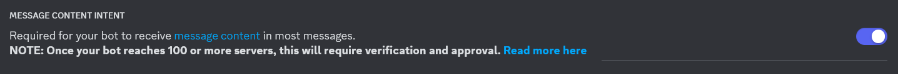

# Derek Bot

### *A bot to imitate your friend's texting style with ChatGPT*


## Features

1. ✅ Replies when pinged.
2. ✅ Replies to last message in channel when your friend (i.e. Derek) starts typing.
3. ✅ Randomly DMs people for added creepiness.
4. ✅ Reacts to messages randomly. Will sometimes react 🤖 to the real Derek.
5. ✅ Will never slur.

## Prerequisites

1. Have a Discord bot. Go to https://discord.com/developers/applications and create a new application. The Message
   Content intent needs to be enabled. It also needs to be able to Read Messages/View Channels and Send Messages, at
   minimum.
   
2. Get a ChatGPT API key. Create a ChatGPT account and go to https://platform.openai.com/api-keys.

## Getting Started

1. Install dependencies with `npm install` in terminal.
2. Put

```ts
export const chatgptkey = "YOUR_CHATGPT_KEY";
export const discordToken = "YOUR_DISCORD_BOT_TOKEN";
export const derekId = "DEREK_DISCORD_ID";
export const botId = "BOT_DISCORD_ID";
```

in `src/Token.ts`.

3. Run `npx tsc` to compile TypeScript.
4. Run `node src/Discord.js`. It should output `Ready!`.
5. To re-run the code after a change, use `npx tsc && node src/Discord.js`.

## Making Your Custom Bot

Most (but not all) of the Derek specific data can be found in `Examples.ts`. Channel whitelists can be found in the `nogoChannels` and `yesChannels` variables in `Discord.ts`.
